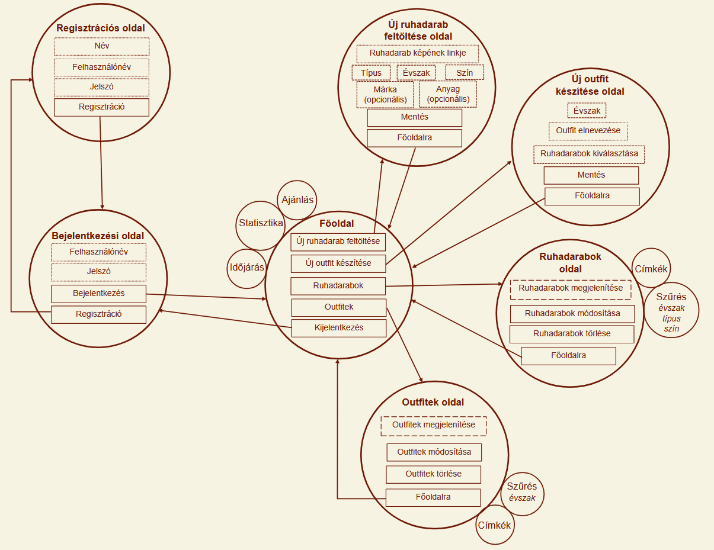

# Funkcionális specifikáció

## 1. A rendszer céljai és nem céljai

### 1.1 A rendszer céljai

A rendszer célja egy olyan **webalkalmazás** fejlesztése, amely segíti a felhasználókat ruhadarabjaik rendszerezésében,
nyilvántartásában és outfitjeik megtervezésében.  
A felhasználók regisztráció után saját ruhatárat hozhatnak létre, ahol a ruhadarabokat különféle jellemzők alapján kezelhetik.

A rendszer biztosítja:

- új ruhadarabok és outfitek **feltöltését, módosítását és törlését**,
- a **legkedveltebb és aktuális évszakhoz illő ruhadarabok** megjelenítését a főoldalon,
- **szűrési lehetőséget** a ruhadarabok és outfitek között,
- valamint az **aktuális időjárás megjelenítését** egy külső API segítségével.

A cél egy **modern, felhasználóbarát és személyre szabható** rendszer, amely támogatja a felhasználókat a mindennapi
öltözködés megtervezésében.

### 1.2 A rendszer ***NEM*** céljai

A rendszer fejlesztésének nem célja a ruhatárkezelésen túlmutató vagy közösségi funkciók megvalósítása.  
Kifejezetten **nem cél**, hogy a rendszer:

- **Online kereskedelmi platformként** működjön _(nem biztosít vásárlási, eladási vagy rendelési lehetőséget)_,
- **Közösségi hálózati funkciókat** valósítson meg _(nincs posztolás, kommentelés, üzenetküldés)_,
- Lehetővé tegye a **felhasználók közötti adatmegosztást** _(pl. ruhadarabok vagy outfitek megosztását más felhasználókkal)_,
- **Automatikus ajánlórendszert** _(pl. gépi tanulás alapú outfit-ajánlás)_ tartalmazzon,
- **Adminisztrátori felületet** vagy többszintű jogosultságkezelést biztosítson,
- **Mobilalkalmazásként** _(Android/iOS)_ működjön — a cél kizárólag a webes böngésző alapú verzió.

A rendszer célzottan egy **egyszerű, személyes használatra szánt webalkalmazás**, amely a ruhadarabok és outfitek kezelésére koncentrál.

## 2. Jelenlegi helyzet

A mindennapi öltözködés sokak számára nap mint nap időigényes folyamat.
A döntés gyakran stresszt is okoz, hiszen a reggeli rohanás közepette kevés idő jut a megfelelő öltözék kiválasztására.
A ruhadarabok átláthatóságát nehezíti, hogy azokat csupán fizikailag tároljuk,
így a szekrény mélyén rejlő darabok gyakran feledésbe merülnek, miközben néhány kedvenc ruhát újra és újra előveszünk.

Az outfit-összeállítás többnyire spontán döntéseken alapul, és nem támaszkodik semmilyen rendszerre vagy vizuális segítségre.
Az időjárási tényezők figyelembevételét a legtöbben manuálisan végzik, ami nem mindig eredményez optimális választást.
Emellett hiányzik az átfogó visszajelzés arról, hogy egyes ruhadarabok mennyire vannak kihasználva,
illetve mely kombinációk bizonyultak korábban sikeresnek. Mindez hosszú távon megnehezíti a tudatos öltözködést és a gardrób hatékony menedzselését.

## 3. Vágyálom rendszer

Célunk egy innovatív, vizuális és felhasználóbarát alkalmazás fejlesztése, amely központosítja a gardróbkezelést és
meggyorsítja az öltözékválasztási folyamatot. Eszközöket biztosít a darabok közötti navigáció megkönnyítése érdekében.
Ilyen eszköz például a ruhadarbak közötti szűrés és azok kategorizálása különböző szempontok alapján, legkedveltebb darabok
megjelölése. Ez elősegíti a felhasználó számára a lehetőségek közötti átláthatóságot, mely a legoptimálisabb döntés
meghozatalát kívánja támogatni.

A rendszer használatához regisztráció és bejelentkezés szükséges a személyes
adatok biztonságos tárolása érdekében.

A rendszer fő erőssége a kényelmes összeállítási felület, ahol a feltöltött ruhadarabokat a felhasználó vizuálisan,
digitális környezetben tudja egymással variálni.
Továbbá a rendszer időjárás-előrejelzést jelenít meg a főoldalon, és ennek megfelelően javaslatokat tesz az aktuális évszaknak
megfelelő ruhadarabokra, ezzel segítve a felhasználót a praktikus döntéshozatalban.
A főoldalon szintén megjelenítésre kerülő statisztikai adatok segítik a felhasználót gardróbja optimalizálásában. Ez a
funkció kiemeli a leggyakrabban viselt darabokat, illetve felhívja a figyelmet a túl ritkán választott, feleslegesnek tűnő elemekre.

Ezen felül szeretnénk segítséget nyújtani a darabok összeállítása terén egy funkcióval, ami lehetővé teszi, hogy más
felhasználók által megosztott összeállítások inspiráljanak egy új megjelenést. Ez a funkció magába foglalja a saját
ötletek nyílvános megosztását a fentebb kifejtett céllal.

Továbbá szeretnénk, ha a felület használata nem csak praktikus lenne, hanem egyben élményt nyújtana a felhasználónak.
Ezt az elhatározást szemelőtt tartva kerül megtervezésre a felület kinézete, melynek a könnyen kezelhetőseg megvalósítása
mellett feladata biztosítani a vizuális élményt.

## 4. Jelenlegi üzleti folyamatok

**A jelenlegi öltözködési folyamat lépései:**

1. **Gardrób áttekintése:** Időigényes folyamat, a legtöbb esetben nem jut idő minden ruhadarab átnézésére.
2. **Ruhadarabok kiválasztása:** A döntés sokszor nem tudatos. Nagy segítséget jelentene, ha csak a keresésnek megfelelő ruhadarabokból kellene választani.
3. **Próbálgatás:** A kiválasztott ruhadarabokat fel kell próbálni, hogy megbizonyosodjunk az összeillőségükről.
4. **Időjárás ellenőrzése:** Ez sokszor elmarad.
5. **Outfit fejben való megjegyzése:** A jól bevált öltözékeket a felhasználók gyakran elfelejtik, így a folyamatot később újra elölről kell kezdeni.

Ez a folyamat szervezetlen, és nagymértékben az ember memóriájára és idejére épít, ami **átláthatatlanságot és időveszteséget** okoz.

## 5. Igényelt üzleti folyamatok

### 5.1 Igényelt üzleti folyamatok leírása

A felhasználónak a rendszer használatához **regisztrálnia** kell. Ehhez meg kell adnia a nevét, felhasználónevét és jelszavát,
majd **be kell jelentkeznie** a fiókjába.
A sikeres bejelentkezés után a **Főoldalra** navigál, ahol azonnali áttekintést kap az **időjárásról**,
a viselési **statisztikáiról**, valamint az **aktuális évszaknak megfelelő ajánlásokról**.

A felhasználó a **felső navigációs menün** keresztül elérheti a fő funkciókat:
- **Új ruhadarab feltöltése**: Az "**Új**" lenyíló menüben választható opció. Ezen a felületen a felhasználó új ruhadarabokat tölthet fel, megadva a következő adatokat: *kép URL, típus, szín, évszak, márka (opcionális), anyag (opcionális)*.
- **Új outfit létrehozása**: Az "**Új**" lenyíló menüben választható opció. Ezen a felületen új outfiteket tud létrehozni a felhasználó, a korábban feltöltött ruhadarabokból. Nevet adhat az outfiteknek, illetve évszakot rendelhet hozzá.
- **Ruhadarabok megjelenítése**: A "**Gardróbom**" lenyíló menüben választható opció. Ezen a felületen megjelenik az összes ruhadarab címkékkel ellátva. Lehetőség van **szűrésre** *(típus, szín és évszak alapján)*, **módosításra** és **törlésre**.
- **Outfitek megjelenítése**: A "**Gardróbom**" lenyíló menüben választható opció. Ezen a felületen megjelenik az összes outfit címkékkel ellátva. Lehetőség van **szűrésre** *(évszak alapján)*, **módosításra** és **törlésre**.
- **Kijelentkezés**: A **profil ikonon** keresztül, visszairányít a bejelentkezési felületre.

### 5.2 Igényelt üzleti folyamatok diagram

## 6. Használati esetek

### 6.1 Aktorok (szereplők) meghatározása

|Aktor neve| Leírás                                                                                              |
|---|-----------------------------------------------------------------------------------------------------|
|**Regisztrált Felhasználó**| A rendszer egyetlen szereplője, aki a regisztráció és bejelentkezés után kezeli a saját gardróbját. |

### 6.2 Használati eset diagram

## 7. Követelménylista

| Modul        | ID  | Név                         | v.  | Kifejtés                                                                                                                                                                                     |
|--------------|-----|-----------------------------|-----|----------------------------------------------------------------------------------------------------------------------------------------------------------------------------------------------|
| Jogosultság  | K1  | Regisztrációs felület       | 1.0 | A felhasználó név, felhasználónév és jelszó megadásával regisztrálhat. Az adatok titkosított formában kerülnek az adatbázisba. Hiányos vagy hibás adat esetén a rendszer hibaüzenetet küld.  |
| Jogosultság  | K2  | Bejelentkezési felület      | 1.0 | A felhasználó a regisztrációkor megadott felhasználónév és jelszó megadásával tud bejelentkezni. Hibás adatok esetén a rendszer hibaüzenetet jelenít meg.                                    |
| Felület      | K3  | Landing page (Főoldal)      | 1.0 | A felhasználó bejelentkezés után a főoldalra kerül, ahol megjelennek az aktuális évszakhoz illő ruhadarabjai és legkedveltebb ruhadarabjai. A rendszer az aktuális időjárást is megjeleníti. |
| Felület      | K4  | Legkedveltebb ruhadarabok   | 1.0 | A főoldalon megjelennek a felhasználó által leggyakrabban használt ruhadarabok.                                                                                                              |
| Felület      | K5  | Évszak szerinti ruhadarabok | 1.0 | A főoldalon a rendszer az aktuális évszaknak megfelelő ruhadarabokat jeleníti meg.                                                                                                           |
| Felület      | K6  | Ruhadarabok oldal           | 1.0 | A felhasználó ezen az oldalon látja az összes feltöltött ruhadarabját Bootstrap kártyák formájában. A kártyákon módosítás és törlés gomb található.                                          |
| Felület      | K7  | Ruhadarab szűrés            | 1.0 | A ruhadarabok oldalon a felhasználó szűrhet évszak, típus és szín alapján.                                                                                                                   |
| Felület      | K8  | Outfitek oldal              | 1.0 | A felhasználó ezen az oldalon látja az összes általa létrehozott outfitet, kártyás elrendezésben.                                                                                            |
| Felület      | K9  | Outfit szűrés               | 1.0 | Az outfitek oldalon a felhasználó szűrhet évszak alapján.                                                                                                                                    |
| Feladattípus | K10 | Ruhadarab hozzáadása        | 1.0 | A felhasználó új ruhadarabokat tölthet fel a következő adatok megadásával: típus, évszak, márka, szín, anyag, kép (image_url).                                                               |
| Feladattípus | K11 | Ruhadarab módosítása        | 1.0 | A felhasználó módosíthatja a ruhadarabok adatait.                                                                                                                                            |
| Feladattípus | K12 | Ruhadarab törlése           | 1.0 | A felhasználó törölheti az általa feltöltött ruhadarabokat.                                                                                                                                  |
| Feladattípus | K13 | Outfit összeállítás         | 1.0 | A felhasználó korábban feltöltött ruhadarabokból új outfitet készíthet, valamint megadhatja az outfit nevét, illetve évszakját.                                                              |
| Feladattípus | K14 | Outfit módosítása           | 1.0 | A felhasználó módosíthatja az általa létrehozott outfiteket.                                                                                                                                 |
| Feladattípus | K15 | Outfit törlése              | 1.0 | A felhasználó törölheti az általa létrehozott outfiteket.                                                                                                                                    |
| Adatkezelés  | K16 | Tárolás                     | 1.0 | A rendszer az adatokat PostgreSQL adatbázisban fogja eltárolni.                                                                                                                              |
| Adatkezelés  | K17 | Időjárás adat lekérése      | 1.0 | A rendszer külső API segítségével lekéri az aktuális időjárást és megjeleníti az összes oldalon.                                                                                             |

## 8. Képernyőtervek

### 8.1 Bejelentkezési oldal

### 8.2 Regisztrációs oldal

### 8.3 Főoldal

### 8.4 Ruhadarabok oldal

### 8.5 Outfitek oldal

### 8.6 Új ruhadarab feltöltése oldal

### 8.7 Új outfit készítése oldal

## 9. Forgatókönyvek

**Stílusos Stella** minden nap imádott csinosan és az alkalomhoz illően öltözködni, de a szekrénye tele volt ruhákkal, amiket már rég elfelejtett. Egy reggel, miközben az időjárás hirtelen lehűlt, Stella rájött, hogy órákig tart, mire kitalálja, mit vegyen fel.

Ekkor talált rá a **SuitUp** webalkalmazásra – egy digitális gardróbra, ahol végre rendszerezhette ruháit. Feltöltötte kedvenc darabjait, megjelölte, melyik illik a tavaszi vagy őszi időszakhoz, és még outfiteket is összeállíthatott belőlük.

Most, amikor bejelentkezik a SuitUpba, a főoldalon azonnal látja az aktuális időjárást, és az alkalmazás ajánl neki néhány tökéletes ruhadarabot az aktuális évszakra. Ha valamelyik outfitje már nem tetszik, egyszerűen átszerkeszti – a SuitUp mindig alkalmazkodik az ízléséhez.

A SuitUp segítségével Stella nemcsak időt spórol, hanem újra felfedezte a saját ruhatárát. 

### User Stories

- [User Story 1 - Regisztráció és Bejelentkezés](user_stories/sprint3/user_story_1.md)
- [User Story 2 - Ruhadarabok kezelése](user_stories/sprint1/user_story_2.md)
- [User Story 3 -  Outfitek létrehozása és kezelése](user_stories/sprint2/user_story_3.md)
- [User Story 4 - Főoldali megjelenítés és inspiráció](user_stories/sprint4/user_story_4.md)
- [User Story 5 - Szűrési lehetőségek](user_stories/sprint4/user_story_5.md)
- [User Story 6 - Időjárás megjelenítése](user_stories/sprint3/user_story_6.md)

## 10. Fogalomtár

| Fogalom                                 | Meghatározás                                                                                                                                           |
|-----------------------------------------| ------------------------------------------------------------------------------------------------------------------------------------------------------ |
| **Ruhadarab**                           | A felhasználó által feltöltött egyedi elem (pl. nadrág, póló, kabát), amelyhez jellemzők tartoznak, mint típus, szín, évszak, márka, anyag és kép.     |
| **Outfit / Szett**                      | Több ruhadarabból összeállított öltözék, amelyet a felhasználó elnevezhet és évszakhoz rendelhet.                                                      |
| **Felhasználó (Regisztrált felhasználó)** | A rendszer egyetlen aktív szereplője, aki regisztráció és bejelentkezés után használhatja az alkalmazás funkcióit.                                     |
| **Főoldal / Landing page**              | A bejelentkezés utáni kezdőoldal, amely megjeleníti az aktuális időjárást, az évszakhoz illő és legkedveltebb ruhadarabokat, valamint statisztikákat.  |
| **Szűrés**                              | Funkció, amely lehetővé teszi a ruhadarabok és outfitek listájának szűkítését meghatározott feltételek (pl. típus, szín, évszak) alapján.              |
| **Időjárás API**                        | Külső szolgáltatás, amely az aktuális meteorológiai adatokat biztosítja a rendszer számára, megkönnyítve az évszakhoz illő ruhadarabok megjelenítését. |
| **Statisztika modul**                   | A rendszer azon része, amely elemzi a ruhadarabok és outfitek használatát, és kimutatja a leggyakrabban vagy legritkábban viselt elemeket.             |
| **Kedvenc ruhadarab**                   | A rendszer által azonosított vagy a felhasználó által megjelölt, leggyakrabban használt ruhadarab.                                                     |
| **Adatbázis**               | A rendszer háttértára, amelyben minden felhasználói adat, ruhadarab és outfit biztonságosan, strukturált formában kerül tárolásra.                     |
