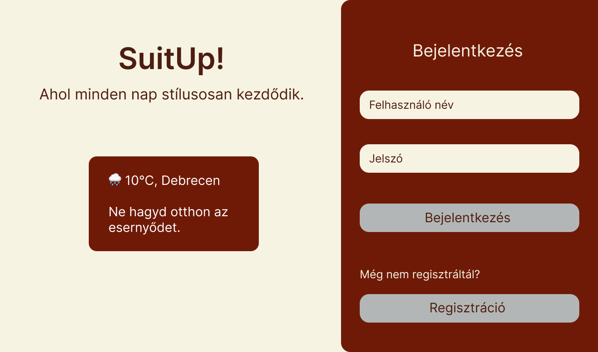

# Funkcionális specifikáció

## 1. A rendszer céljai és nem céljai

### 1.1 A rendszer céljai

A rendszer célja egy olyan **webalkalmazás** fejlesztése, amely segíti a felhasználókat ruhadarabjaik rendszerezésében,
nyilvántartásában és outfitjeik megtervezésében.  
A felhasználók regisztráció után saját ruhatárat hozhatnak létre, ahol a ruhadarabokat különféle jellemzők alapján kezelhetik.

A rendszer biztosítja:

- új ruhadarabok és outfitek **feltöltését, módosítását és törlését**,
- a **legkedveltebb és aktuális évszakhoz illő ruhadarabok** megjelenítését a főoldalon,
- **szűrési lehetőséget** a ruhadarabok és outfitek között,
- valamint az **aktuális időjárás megjelenítését** egy külső API segítségével.

A cél egy **modern, felhasználóbarát és személyre szabható** rendszer, amely támogatja a felhasználókat a mindennapi
öltözködés megtervezésében.

### 1.2 A rendszer ***NEM*** céljai

A rendszer fejlesztésének nem célja a ruhatárkezelésen túlmutató vagy közösségi funkciók megvalósítása.  
Kifejezetten **nem cél**, hogy a rendszer:

- **Online kereskedelmi platformként** működjön _(nem biztosít vásárlási, eladási vagy rendelési lehetőséget)_,
- **Közösségi hálózati funkciókat** valósítson meg _(nincs posztolás, kommentelés, üzenetküldés)_,
- Lehetővé tegye a **felhasználók közötti adatmegosztást** _(pl. ruhadarabok vagy outfitek megosztását más felhasználókkal)_,
- **Automatikus ajánlórendszert** _(pl. gépi tanulás alapú outfit-ajánlás)_ tartalmazzon,
- **Adminisztrátori felületet** vagy többszintű jogosultságkezelést biztosítson,
- **Mobilalkalmazásként** _(Android/iOS)_ működjön — a cél kizárólag a webes böngésző alapú verzió.

A rendszer célzottan egy **egyszerű, személyes használatra szánt webalkalmazás**, amely a ruhadarabok és outfitek kezelésére koncentrál.

## 2. Jelenlegi helyzet

## 3. Vágyálom rendszer

## 4. Jelenlegi üzleti folyamatok

## 5. Igényelt üzleti folyamatok

### 5.1 Igényelt üzleti folyamatok leírása

### 5.2 Igényelt üzleti folyamatok diagram

## 6. Használati esetek

### 6.1 Aktorok (szereplők) meghatározása

### 6.2 Használati eset diagram

## 7. Követelménylista

| Modul        | ID  | Név                         | v.  | Kifejtés                                                                                                                                                                                     |
|--------------|-----|-----------------------------|-----|----------------------------------------------------------------------------------------------------------------------------------------------------------------------------------------------|
| Jogosultság  | K1  | Regisztrációs felület       | 1.0 | A felhasználó név, felhasználónév és jelszó megadásával regisztrálhat. Az adatok titkosított formában kerülnek az adatbázisba. Hiányos vagy hibás adat esetén a rendszer hibaüzenetet küld.  |
| Jogosultság  | K2  | Bejelentkezési felület      | 1.0 | A felhasználó a regisztrációkor megadott felhasználónév és jelszó megadásával tud bejelentkezni. Hibás adatok esetén a rendszer hibaüzenetet jelenít meg.                                    |
| Felület      | K3  | Landing page (Főoldal)      | 1.0 | A felhasználó bejelentkezés után a főoldalra kerül, ahol megjelennek az aktuális évszakhoz illő ruhadarabjai és legkedveltebb ruhadarabjai. A rendszer az aktuális időjárást is megjeleníti. |
| Felület      | K4  | Legkedveltebb ruhadarabok   | 1.0 | A főoldalon megjelennek a felhasználó által leggyakrabban használt ruhadarabok.                                                                                                              |
| Felület      | K5  | Évszak szerinti ruhadarabok | 1.0 | A főoldalon a rendszer az aktuális évszaknak megfelelő ruhadarabokat jeleníti meg.                                                                                                           |
| Felület      | K6  | Ruhadarabok oldal           | 1.0 | A felhasználó ezen az oldalon látja az összes feltöltött ruhadarabját Bootstrap kártyák formájában. A kártyákon módosítás és törlés gomb található.                                          |
| Felület      | K7  | Ruhadarab szűrés            | 1.0 | A ruhadarabok oldalon a felhasználó szűrhet évszak, típus és szín alapján.                                                                                                                   |
| Felület      | K8  | Outfitek oldal              | 1.0 | A felhasználó ezen az oldalon látja az összes általa létrehozott outfitet, kártyás elrendezésben.                                                                                            |
| Felület      | K9  | Outfit szűrés               | 1.0 | Az outfitek oldalon a felhasználó szűrhet évszak alapján.                                                                                                                                    |
| Feladattípus | K10 | Ruhadarab hozzáadása        | 1.0 | A felhasználó új ruhadarabokat tölthet fel a következő adatok megadásával: típus, évszak, márka, szín, anyag, kép (image_url).                                                               |
| Feladattípus | K11 | Ruhadarab módosítása        | 1.0 | A felhasználó módosíthatja a ruhadarabok adatait.                                                                                                                                            |
| Feladattípus | K12 | Ruhadarab törlése           | 1.0 | A felhasználó törölheti az általa feltöltött ruhadarabokat.                                                                                                                                  |
| Feladattípus | K13 | Outfit összeállítás         | 1.0 | A felhasználó korábban feltöltött ruhadarabokból új outfitet készíthet, valamint megadhatja az outfit nevét, illetve évszakját.                                                              |
| Feladattípus | K14 | Outfit módosítása           | 1.0 | A felhasználó módosíthatja az általa létrehozott outfiteket.                                                                                                                                 |
| Feladattípus | K15 | Outfit törlése              | 1.0 | A felhasználó törölheti az általa létrehozott outfiteket.                                                                                                                                    |
| Adatkezelés  | K16 | Tárolás                     | 1.0 | A rendszer az adatokat PostgreSQL adatbázisban fogja eltárolni.                                                                                                                              |
| Adatkezelés  | K17 | Időjárás adat lekérése      | 1.0 | A rendszer külső API segítségével lekéri az aktuális időjárást és megjeleníti az összes oldalon.                                                                                             |

## 8. Képernyőtervek

### 8.1 Bejelentkezési oldal

### 8.2 Regisztrációs oldal

### 8.3 Főoldal

### 8.4 Ruhadarabok oldal

### 8.5 Outfitek oldal

### 8.6 Új ruhadarab feltöltése oldal

### 8.7 Új outfit készítése oldal

## 9. Forgatókönyvek

**Stílusos Stella** minden nap imádott csinosan és az alkalomhoz illően öltözködni, de a szekrénye tele volt ruhákkal, amiket már rég elfelejtett. Egy reggel, miközben az időjárás hirtelen lehűlt, Stella rájött, hogy órákig tart, mire kitalálja, mit vegyen fel.

Ekkor talált rá a **SuitUp** webalkalmazásra – egy digitális gardróbra, ahol végre rendszerezhette ruháit. Feltöltötte kedvenc darabjait, megjelölte, melyik illik a tavaszi vagy őszi időszakhoz, és még outfiteket is összeállíthatott belőlük.

Most, amikor bejelentkezik a SuitUpba, a főoldalon azonnal látja az aktuális időjárást, és az alkalmazás ajánl neki néhány tökéletes ruhadarabot az aktuális évszakra. Ha valamelyik outfitje már nem tetszik, egyszerűen átszerkeszti – a SuitUp mindig alkalmazkodik az ízléséhez.

A SuitUp segítségével Stella nemcsak időt spórol, hanem újra felfedezte a saját ruhatárát. 

### User Stories

- [User Story 1 - Regisztráció és Bejelentkezés](user_stories/user_story_1.md)
- [User Story 2 - Ruhadarabok kezelése](user_stories/user_story_2.md)
- [User Story 3 -  Outfitek létrehozása és kezelése](user_stories/user_story_3.md)
- [User Story 4 - Főoldali megjelenítés és inspiráció](user_stories/user_story_4.md)