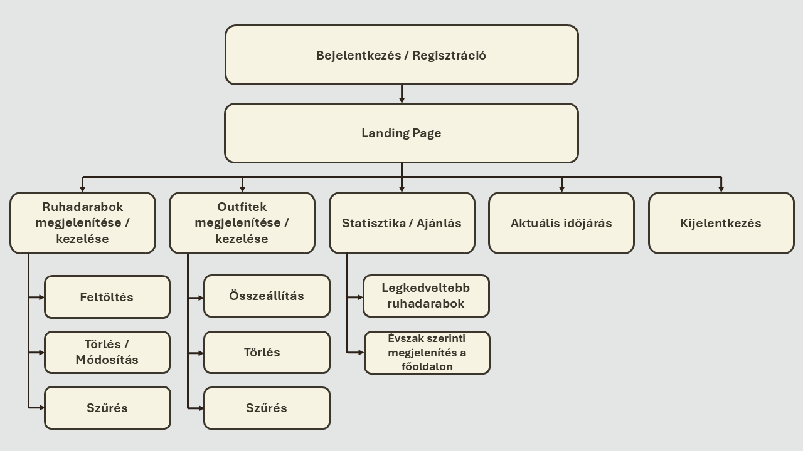

# Követelmény specifikáció

## 1. Áttekintés

## 2. Jelenlegi helyzet

A mindennapi öltözködés sokak számára nap mint nap időigényes folyamat. 
A döntés gyakran stresszt is okoz, hiszen a reggeli rohanás közepette kevés idő jut a megfelelő öltözék kiválasztására.
A ruhadarabok átláthatóságát nehezíti, hogy azokat csupán fizikailag tároljuk, 
így a szekrény mélyén rejlő darabok gyakran feledésbe merülnek, miközben néhány kedvenc ruhát újra és újra előveszünk.

Az outfit-összeállítás többnyire spontán döntéseken alapul, és nem támaszkodik semmilyen rendszerre vagy vizuális segítségre.
Az időjárási tényezők figyelembevételét a legtöbben manuálisan végzik, ami nem mindig eredményez optimális választást.
Emellett hiányzik az átfogó visszajelzés arról, hogy egyes ruhadarabok mennyire vannak kihasználva,
illetve mely kombinációk bizonyultak korábban sikeresnek. Mindez hosszú távon megnehezíti a tudatos öltözködést és a gardrób hatékony menedzselését.

## 3. Vágyálom rendszer

## 4. Funkcionális követelmények

## 5. A rendszerre vonatkozó szabályok

A rendszer fejlesztése és működése során figyelembe kell venni a vonatkozó adatvédelmi, szerzői jogi és etikai
előírásokat.

### Adatvédelem

- Mivel az alkalmazás lehetőséget ad a felhasználói **regisztrációra és bejelentkezésre**, a felhasználók személyes
  adatait a **GDPR** (Európai Unió Általános Adatvédelmi Rendelete) előírásainak megfelelően
  kell kezelni.
- A személyes adatok kizárólag a rendszer működéséhez szükséges mértékben kerülhetnek felhasználásra.
- Az adatokat harmadik félnek továbbítani **nem megengedett**

### Szerzői jogok

- Az alkalmazásban megjelenő képek (pl. ruhadarabok, outfitek) **nem sérthetik más személyek szerzői jogait**.
- Csak a felhasználó által készített, illetve szabadon felhasználható képek használhatók fel.

### Etikai és tartalmi megfelelőség

- Az alkalmazás célközönsége **minden korosztály**, ezért a megjelenített tartalmaknak **nem szabad erőszakos,
  felnőtteknek szánt, diszkriminatív vagy káros tartalmakat** tartalmazniuk.

## 6. Jelenlegi üzleti folyamatok modellje

## 7. Igényelt üzleti folyamatok

## 8. Követelménylista

| Modul        | ID  | Név                         | v.  | Kifejtés                                                                                                                                                                      |
|--------------|-----|-----------------------------|-----|-------------------------------------------------------------------------------------------------------------------------------------------------------------------------------|
| Jogosultság  | K1  | Regisztrációs felület       | 1.0 | A rendszer lehetőséget biztosít új felhasználók számára a regisztrációra név, felhasználónév és jelszó megadásával.                                                           |
| Jogosultság  | K2  | Bejelentkezési felület      | 1.0 | A rendszer biztosítja, hogy a felhasználók a regisztráció során megadott adataikkal be tudjanak jelentkezni a saját fiókjukba.                                                |
| Felület      | K3  | Főoldal (Landing page)      | 1.0 | A bejelentkezést követően a felhasználó a főoldalra kerül, ahol megjelennek a számára releváns tartalmak, például az aktuális évszakhoz illő ruhadarabok és kedvelt outfitek. |
| Felület      | K4  | Legkedveltebb ruhadarabok   | 1.0 | A főoldal megjeleníti a felhasználó által leggyakrabban használt ruhadarabokat.                                                                                               |
| Felület      | K5  | Évszak szerinti ruhadarabok | 1.0 | A főoldalon a rendszer megjeleníti az aktuális évszakhoz illő ruhadarabokat.                                                                                                  |
| Felület      | K6  | Ruhadarabok oldal           | 1.0 | A rendszer külön oldalon jeleníti meg a felhasználó összes feltöltött ruhadarabját.                                                                                           |
| Felület      | K7  | Outfitek oldal              | 1.0 | A rendszer külön oldalon jeleníti meg a felhasználó által létrehozott outfiteket.                                                                                             |
| Feladattípus | K8  | Ruhadarab hozzáadása        | 1.0 | A felhasználó új ruhadarabot tud hozzáadni a saját gyűjteményéhez.                                                                                                            |
| Feladattípus | K9  | Ruhadarab módosítása        | 1.0 | A felhasználó szerkesztheti a már feltöltött ruhadarabok adatait.                                                                                                             |
| Feladattípus | K10 | Ruhadarab törlése           | 1.0 | A felhasználó törölheti az általa feltöltött ruhadarabokat.                                                                                                                   |
| Feladattípus | K11 | Outfit összeállítás         | 1.0 | A felhasználó korábban feltöltött ruhadarabokból összeállíthat új outfiteket.                                                                                                 |
| Feladattípus | K12 | Outfit módosítása           | 1.0 | A felhasználó szerkesztheti a már létrehozott outfiteket.                                                                                                                     |
| Feladattípus | K13 | Outfit törlése              | 1.0 | A felhasználó törölheti a már létrehozott outfiteket.                                                                                                                         |
| Feladattípus | K14 | Ruhadarab szűrés            | 1.0 | A felhasználó különböző feltételek (évszak, típus, szín) alapján tudja szűrni a ruhadarabokat.                                                                                |
| Feladattípus | K15 | Outfit szűrés               | 1.0 | A felhasználó évszak alapján tudja szűrni az outfiteket.                                                                                                                      |
| Adatkezelés  | K16 | Adatok tárolása             | 1.0 | A rendszer kezeli és tárolja a felhasználók, ruhadarabok és outfitek adatait.                                                                                                 |
| Adatkezelés  | K17 | Időjárás megjelenítése      | 1.0 | A rendszer az összes oldalon megjeleníti az aktuális időjárást, hogy segítse a felhasználót az outfitválasztásban.                                                            |

## 8.1 Rendszer áttekintés

## 9. Fogalomtár
