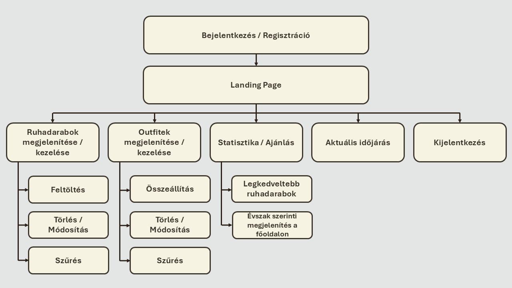

# Követelmény specifikáció

## 1. Áttekintés

A "Suit Up" alkalmazás célja egy olyan felület biztosítása, melynek segítségével a felhasználók digitalizálhatják gardróbjukat, és könnyedén állíthatnak össze, jegyezhetnek fel és követhetnek nyomon öltözékeket.

A rendszer támogatja a ruhadarabok fénykép alapú rögzítését, attribútumokkal való jellemzését, valamint az ezekből álló összeállítások kezelését. A kulcsfontosságú funkciók közé tartozik a szűrés, a statisztikák nyomon követése és a valós idejű időjárás-integráció.

## 2. Jelenlegi helyzet

A mindennapi öltözködés sokak számára nap mint nap időigényes folyamat. 
A döntés gyakran stresszt is okoz, hiszen a reggeli rohanás közepette kevés idő jut a megfelelő öltözék kiválasztására.
A ruhadarabok átláthatóságát nehezíti, hogy azokat csupán fizikailag tároljuk, 
így a szekrény mélyén rejlő darabok gyakran feledésbe merülnek, miközben néhány kedvenc ruhát újra és újra előveszünk.

Az outfit-összeállítás többnyire spontán döntéseken alapul, és nem támaszkodik semmilyen rendszerre vagy vizuális segítségre.
Az időjárási tényezők figyelembevételét a legtöbben manuálisan végzik, ami nem mindig eredményez optimális választást.
Emellett hiányzik az átfogó visszajelzés arról, hogy egyes ruhadarabok mennyire vannak kihasználva,
illetve mely kombinációk bizonyultak korábban sikeresnek. Mindez hosszú távon megnehezíti a tudatos öltözködést és a gardrób hatékony menedzselését.

## 3. Vágyálom rendszer

Célunk egy innovatív, vizuális és felhasználóbarát alkalmazás fejlesztése, amely központosítja a gardróbkezelést és
meggyorsítja az öltözékválasztási folyamatot. Eszközöket biztosít a darabok közötti navigáció megkönnyítése érdekében.
Ilyen eszköz például a ruhadarbak közötti szűrés és azok kategorizálása különböző szempontok alapján, legkedveltebb darabok
megjelölése. Ez elősegíti a felhasználó számára a lehetőségek közötti átláthatóságot, mely a legoptimálisabb döntés
meghozatalát kívánja támogatni.

A rendszer használatához regisztráció és bejelentkezés szükséges a személyes
adatok biztonságos tárolása érdekében.

A rendszer fő erőssége a kényelmes összeállítási felület, ahol a feltöltött ruhadarabokat a felhasználó vizuálisan,
digitális környezetben tudja egymással variálni.
Továbbá a rendszer időjárás-előrejelzést jelenít meg a főoldalon, és ennek megfelelően javaslatokat tesz az aktuális évszaknak
megfelelő ruhadarabokra, ezzel segítve a felhasználót a praktikus döntéshozatalban.
A főoldalon szintén megjelenítésre kerülő statisztikai adatok segítik a felhasználót gardróbja optimalizálásában. Ez a
funkció kiemeli a leggyakrabban viselt darabokat, illetve felhívja a figyelmet a túl ritkán választott, feleslegesnek tűnő elemekre.

Ezen felül szeretnénk segítséget nyújtani a darabok összeállítása terén egy funkcióval, ami lehetővé teszi, hogy más
felhasználók által megosztott összeállítások inspiráljanak egy új megjelenést. Ez a funkció magába foglalja a saját
ötletek nyílvános megosztását a fentebb kifejtett céllal.

Továbbá szeretnénk, ha a felület használata nem csak praktikus lenne, hanem egyben élményt nyújtana a felhasználónak.
Ezt az elhatározást szemelőtt tartva kerül megtervezésre a felület kinézete, melynek a könnyen kezelhetőseg megvalósítása
mellett feladata biztosítani a vizuális élményt.

## 4. Funkcionális követelmények

- **Felhasználó- és Munkamenetkezelés (Hitelesítés)**
    - Regisztráció: fióklétrehozás *név*, *felhasználónév* és *jelszó* megadásával.
    - Bejelentkezés: regisztrált felhasználónév-jelszó párossal.
    - Kijelentkezés
- **Ruhadarab Kezelés (CRUD műveletek)**
    - Új darab felvétele (Létrehozás): kép feltöltése, attribútumok *(pl.: típus, évszak, márka, szín, anyag)* megadása.
    - Elem szerkesztése/törlése
    - Szűrés/Keresés: rögzített attribútumok *(pl.: típus, évszak, szín, márka, anyag)* alapján.
- **Összeállítások Kezelés (CRUD műveletek)**
    - Összeállítás létrehozása és Mentése: feltöltött elemek közötti variáció (típus szerinti gyűjteményekből) és mentés
      címkék *(pl.: cím, évszak)* megadásának lehetőségével
    - Szett Törlése
    - Viselés Követése: manuálisan kezelhető elem a számlálásához.
- **Galéria *(Gardrób)* Megjelenítés**
    - Ruhadarab nézet: egy oldal az összes feltöltött ruhadarabnak.
    - Szett nézet: egy oldal a mentett összeállításoknak (lekicsinyített, kerettel ellátott szerkezetben).
- **Integrációk és Adatmegjelenítés**
    - Időjárás-integráció: külső API használatával.
    - Javaslatok: aktuális évszaknak megfelelő, viselésre ajánlott ruhadarabok listája.
    - Statisztika: elemek viselési gyakoriságából származó statisztikák.
- **Felhasználói élményt javító funkciók**
    - elemek átlátható megjelenítése
    - harmonikus kinézet
    - időjáráshoz igazodó üzenetek

## 5. A rendszerre vonatkozó szabályok

A rendszer fejlesztése és működése során figyelembe kell venni a vonatkozó adatvédelmi, szerzői jogi és etikai
előírásokat.

### Adatvédelem

- Mivel az alkalmazás lehetőséget ad a felhasználói **regisztrációra és bejelentkezésre**, a felhasználók személyes
  adatait a **GDPR** (Európai Unió Általános Adatvédelmi Rendelete) előírásainak megfelelően
  kell kezelni.
- A személyes adatok kizárólag a rendszer működéséhez szükséges mértékben kerülhetnek felhasználásra.
- Az adatokat harmadik félnek továbbítani **nem megengedett**

### Szerzői jogok

- Az alkalmazásban megjelenő képek (pl. ruhadarabok, outfitek) **nem sérthetik más személyek szerzői jogait**.
- Csak a felhasználó által készített, illetve szabadon felhasználható képek használhatók fel.

### Etikai és tartalmi megfelelőség

- Az alkalmazás célközönsége **minden korosztály**, ezért a megjelenített tartalmaknak **nem szabad erőszakos,
  felnőtteknek szánt, diszkriminatív vagy káros tartalmakat** tartalmazniuk.

## 6. Jelenlegi üzleti folyamatok modellje

**A jelenlegi öltözködési folyamat lépései:**

1. **Gardrób áttekintése:** Időigényes folyamat, a legtöbb esetben nem jut idő minden ruhadarab átnézésére.
2. **Ruhadarabok kiválasztása:** A döntés sokszor nem tudatos. Nagy segítséget jelentene, ha csak a keresésnek megfelelő ruhadarabokból kellene választani.
3. **Próbálgatás:** A kiválasztott ruhadarabokat fel kell próbálni, hogy megbizonyosodjunk az összeillőségükről.
4. **Időjárás ellenőrzése:** Ez sokszor elmarad.
5. **Outfit fejben való megjegyzése:** A jól bevált öltözékeket a felhasználók gyakran elfelejtik, így a folyamatot később újra elölről kell kezdeni.

Ez a folyamat szervezetlen, és nagymértékben az ember memóriájára és idejére épít, ami **átláthatatlanságot és időveszteséget** okoz.

## 7. Igényelt üzleti folyamatok

A felhasználónak a rendszer használatához **regisztrálnia** kell. Ehhez meg kell adnia a nevét, felhasználónevét és jelszavát,
majd **be kell jelentkeznie** a fiókjába.
A sikeres bejelentkezés után a **Főoldalra** navigál, ahol azonnali áttekintést kap az **időjárásról**, 
a viselési **statisztikáiról**, valamint az **aktuális évszaknak megfelelő ajánlásokról**.

A felhasználó a **felső navigációs menün** keresztül elérheti a fő funkciókat:
- **Új ruhadarab feltöltése**: Az "**Új**" lenyíló menüben választható opció. Ezen a felületen a felhasználó új ruhadarabokat tölthet fel, megadva a következő adatokat: *kép URL, típus, szín, évszak, márka (opcionális), anyag (opcionális)*.
- **Új outfit létrehozása**: Az "**Új**" lenyíló menüben választható opció. Ezen a felületen új outfiteket tud létrehozni a felhasználó, a korábban feltöltött ruhadarabokból. Nevet adhat az outfiteknek, illetve évszakot rendelhet hozzá.
- **Ruhadarabok megjelenítése**: A "**Gardróbom**" lenyíló menüben választható opció. Ezen a felületen megjelenik az összes ruhadarab címkékkel ellátva. Lehetőség van **szűrésre** *(típus, szín és évszak alapján)*, **módosításra** és **törlésre**.
- **Outfitek megjelenítése**: A "**Gardróbom**" lenyíló menüben választható opció. Ezen a felületen megjelenik az összes outfit címkékkel ellátva. Lehetőség van **szűrésre** *(évszak alapján)* és **törlésre**.
- **Kijelentkezés**: A **profil ikonon** keresztül, visszairányít a bejelentkezési felületre.

## 8. Követelménylista

| Modul        | ID  | Név                         | v.  | Kifejtés                                                                                                                                                                      |
|--------------|-----|-----------------------------|-----|-------------------------------------------------------------------------------------------------------------------------------------------------------------------------------|
| Jogosultság  | K1  | Regisztrációs felület       | 1.0 | A rendszer lehetőséget biztosít új felhasználók számára a regisztrációra név, felhasználónév és jelszó megadásával.                                                           |
| Jogosultság  | K2  | Bejelentkezési felület      | 1.0 | A rendszer biztosítja, hogy a felhasználók a regisztráció során megadott adataikkal be tudjanak jelentkezni a saját fiókjukba.                                                |
| Felület      | K3  | Főoldal (Landing page)      | 1.0 | A bejelentkezést követően a felhasználó a főoldalra kerül, ahol megjelennek a számára releváns tartalmak, például az aktuális évszakhoz illő ruhadarabok és kedvelt outfitek. |
| Felület      | K4  | Legkedveltebb ruhadarabok   | 1.0 | A főoldal megjeleníti a felhasználó által leggyakrabban használt ruhadarabokat.                                                                                               |
| Felület      | K5  | Évszak szerinti ruhadarabok | 1.0 | A főoldalon a rendszer megjeleníti az aktuális évszakhoz illő ruhadarabokat.                                                                                                  |
| Felület      | K6  | Ruhadarabok oldal           | 1.0 | A rendszer külön oldalon jeleníti meg a felhasználó összes feltöltött ruhadarabját.                                                                                           |
| Felület      | K7  | Outfitek oldal              | 1.0 | A rendszer külön oldalon jeleníti meg a felhasználó által létrehozott outfiteket.                                                                                             |
| Feladattípus | K8  | Ruhadarab hozzáadása        | 1.0 | A felhasználó új ruhadarabot tud hozzáadni a saját gyűjteményéhez.                                                                                                            |
| Feladattípus | K9  | Ruhadarab módosítása        | 1.0 | A felhasználó szerkesztheti a már feltöltött ruhadarabok adatait.                                                                                                             |
| Feladattípus | K10 | Ruhadarab törlése           | 1.0 | A felhasználó törölheti az általa feltöltött ruhadarabokat.                                                                                                                   |
| Feladattípus | K11 | Outfit összeállítás         | 1.0 | A felhasználó korábban feltöltött ruhadarabokból összeállíthat új outfiteket.                                                                                                 |
| Feladattípus | K12 | Outfit törlése              | 1.0 | A felhasználó törölheti a már létrehozott outfiteket.                                                                                                                         |
| Feladattípus | K13 | Ruhadarab szűrés            | 1.0 | A felhasználó különböző feltételek (évszak, típus, szín) alapján tudja szűrni a ruhadarabokat.                                                                                |
| Feladattípus | K14 | Outfit szűrés               | 1.0 | A felhasználó évszak alapján tudja szűrni az outfiteket.                                                                                                                      |
| Adatkezelés  | K15 | Adatok tárolása             | 1.0 | A rendszer kezeli és tárolja a felhasználók, ruhadarabok és outfitek adatait.                                                                                                 |
| Adatkezelés  | K16 | Időjárás megjelenítése      | 1.0 | A rendszer az összes oldalon megjeleníti az aktuális időjárást, hogy segítse a felhasználót az outfitválasztásban.                                                            |

## 8.1 Rendszer áttekintés

## 9. Fogalomtár

| **Fogalom**             | **Meghatározás**                                                                                           |
|-------------------------|------------------------------------------------------------------------------------------------------------|
| **Felhasználó**         | Az a személy, aki regisztrál és használja az alkalmazás funkcióit.                                         |
| **Ruhadarab**           | A felhasználó által feltöltött, képpel és jellemzőkkel ellátott ruhatári elem.                             |
| **Outfit / Szett**      | Több ruhadarabból álló összeállítás, amelyet a felhasználó hoz létre és ment el.                           |
| **Attribútum**          | A ruhadarab jellemző tulajdonsága *(pl. típus, szín, évszak, márka, anyag)*.                               |
| **Gardrób**             | A felhasználó által feltöltött ruhadarabok gyűjteménye, digitális formában megjelenítve.                   |
| **CRUD műveletek**      | Alapvető adatkezelési műveletek: létrehozás, olvasás, módosítás, törlés.                                   |
| **Időjárás-integráció** | Külső adatforrásból (API) származó aktuális időjárási adatok megjelenítése az outfitválasztás támogatásához. |

