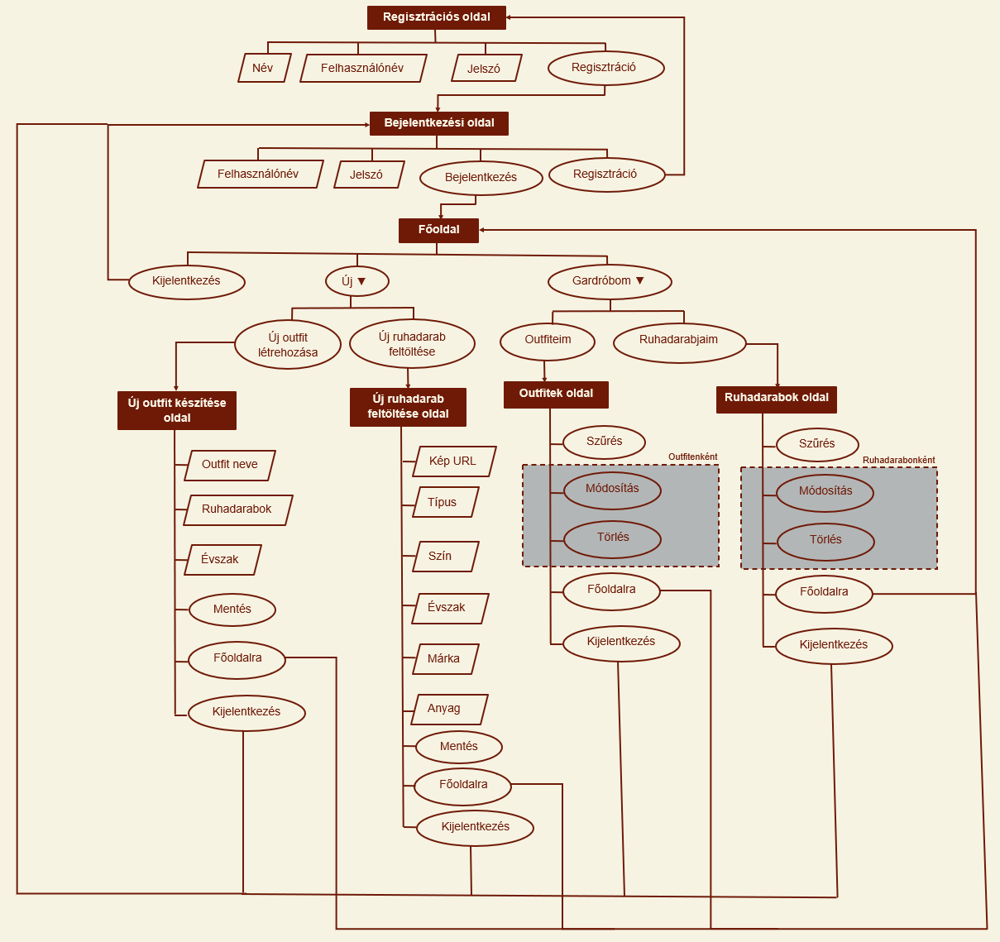
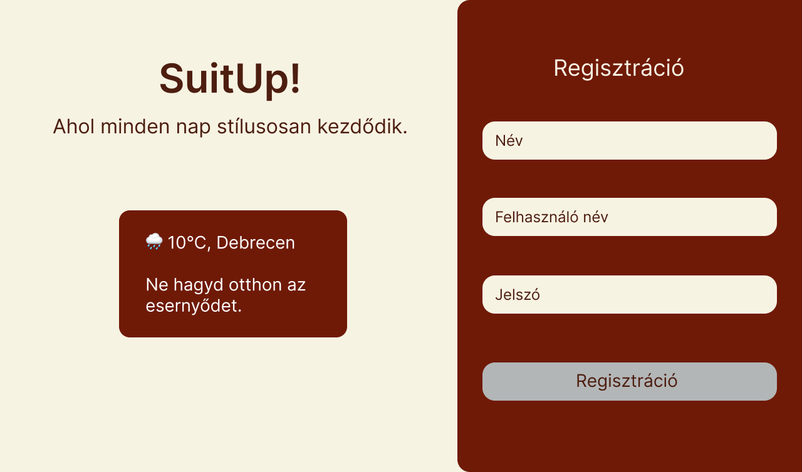
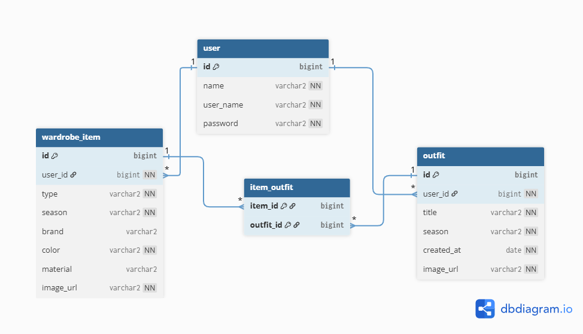

# Rendszerterv

## 1. A rendszer célja

A rendszer célja egy olyan **webalkalmazás** fejlesztése, amely segíti a felhasználókat ruhadarabjaik rendszerezésében,
nyilvántartásában és outfitjeik megtervezésében.  
A felhasználók regisztráció után saját ruhatárat hozhatnak létre, ahol a ruhadarabokat különféle jellemzők alapján
kezelhetik.

A rendszer biztosítja:

- új ruhadarabok **feltöltését, módosítását és törlését** és az outfitek **feltöltését törlését**,,
- a **legkedveltebb és aktuális évszakhoz illő ruhadarabok** megjelenítését a főoldalon,
- **szűrési lehetőséget** a ruhadarabok és outfitek között,
- valamint az **aktuális időjárás megjelenítését** egy külső API segítségével.

A cél egy **modern, felhasználóbarát és személyre szabható** rendszer, amely támogatja a felhasználókat a mindennapi
öltözködés megtervezésében.

## 2. Projektterv

### 2.1  Projektszerepkörök, felelősségek

* **PM** (Project Manager): Az a személy, aki a projekt vezeti. Ez a személy végzi a projekt felülvizsgálatát, mind
  részfeladatok meghatározása, mind változtatások bekerülése terén.
* **UI/UX Designer**: Felhasználóbarát és átlátható felület tervezése. Színek, ikonok, tipográfia, reszponzív elrendezés
  meghatározása
* **PA** (Program Analyst): Tervezésért, fejlesztésért felelős személy. Optimális megoldások kifejlesztésére is
  hivatott. Programkódok írása.
* **QA** (Quality Assurance): Teszteket biztosít a projekthez, amik a kód helyes működést támasztják alá.

### 2.2 Projektmunkások és felelősségeik

* **Varga Tímea**: *PM, PA*
* **Szőllős Boglárka**: *UI/UX Designer, PA*
* **Kántor Kamilla**: *QA, PA*

### 2.3 Ütemterv

**Ütemterv:**

| Funkció / Story               | Feladat / Task                                                                                                              | Prioritás | Becsült szükséges idő (óra) | Ráfordított idő (óra) |
|-------------------------------|-----------------------------------------------------------------------------------------------------------------------------|-----------|-----------------------------|-----------------------|
| Követelmény specifikáció      | Követelmények összegyűjtése                                                                                                 | 1         | 6                           | 6                     |
| Funkcionális specifikáció     | Funkciók meghatározása, use-case-ek meghatározása , user story-k kidolgozása                                                | 1         | 6                           | 6                     |
| Rendszerterv                  | Adatbázisterv, architektúrális modell, menü-hierarchia, képernyőtervek készítése, technológiák kiválasztása                 | 1         | 6                           | 6                     |
| Szerveroldal létrehozása      | Adatbáziskapcsolat megvalósítása, regisztárció/bejelentkezés, CRUD műveletek implementálása                                 | 2         | 24                          | 24                    |
| Kinézet létrehozása           | Szerveroldali megjelenítés kialakítása sablonok segítségével, reszponzív elrendezéssel és újrahasznosítható oldalelemekkel. | 2         | 18                          | 18                    |
| Tesztek megírása és futtatása | Funkcionális teszt, reszponzív teszt, hibajavítás                                                                           | 3         | 8                           | 8                     |

## 3. Üzleti folyamatok modellje

### 3.1 Üzleti szereplők

* **Felhasználó:**
  A rendszer végfelhasználója, aki regisztrál, bejelentkezik, ruhadarabokat és outfiteket kezel, valamint megtekinti az
  ajánlásokat és statisztikákat.

* **Rendszer:**
  A háttérben futó alkalmazás, amely kezeli a felhasználói műveleteket, tárolja és megjeleníti az adatokat, valamint
  kommunikál a külső időjárás-API-val.

* **Megrendelő:**
  A rendszer funkcionális és üzleti igényeit meghatározó fél, aki a fejlesztési követelményeket definiálja.

### 3.2 Üzleti folyamatok

#### Regisztráció

* A felhasználó regisztrál a rendszerben, megadva nevét, felhasználónevét és jelszavát.
* A rendszer eltárolja az adatokat, és létrehozza a felhasználói fiókot.

#### Bejelentkezés

* A felhasználó megadja a felhasználónevét és a jelszavát, amelyet a rendszer hitelesít.
* Bejelentkezés után a felhasználó a főoldalra kerül, ahol személyre szabott információkat lát.

#### Kijelentkezés

* A felhasználó a profil ikonra kattintva megnyitja a lenyíló menüt, ahol a "Kijelentkezés" opciót választja.
* A rendszer bontja a munkamenetet és visszairányítja a felhasználót a Bejelentkezési oldalra.

#### Ruhadarabok kezelése

* **Új ruhadarab létrehozása:** a felhasználó feltölti a ruhadarab képének URL-jét, emellett különböző jellemzőket
  rendelhet hozzá: típus, szín, évszak, anyag, márka.
* **Módosítás és törlés:** a felhasználó szerkesztheti vagy eltávolíthatja a már feltöltött ruhadarabokat.
* **Szűrés:** a rendszer lehetővé teszi a ruhadarabok listázásának szűrését típus, szín és évszak alapján.
* **Megjelenítés:** a felhasználó megtekintheti az összes feltöltött ruhadarabot címkékkel és előnézeti képpel.

#### Outfitek kezelése

* **Új outfit létrehozása:** a felhasználó a feltöltött ruhadarabokból állíthat össze szetteket, amelyekhez nevet és
  évszakot rendelhet.
* **Törlése:** a rendszer támogatja a korábban mentett kombinációk eltávolítását.
* **Szűrés:** a rendszer lehetővé teszi az outfitek listázásának szűrését évszak alapján.
* **Megjelenítés:** a felhasználó megtekintheti az összes mentett outfitet címkékkel és előnézeti képekkel.

#### Integrációk

* **Időjárás-integráció:** a rendszer külső API segítségével megjeleníti az aktuális időjárást.

#### Statisztikák és ajánlások

* **Statisztikák:** a rendszer megjeleníti a leggyakrabban viselt ruhadarabokat.
* **Ajánlások:** a rendszer az aktuális évszakhoz illeszkedő ruhadarabokat javasol.

### 3.3 Üzleti entitások

* **Felhasználó:**
  A rendszer regisztrált használója.
    * *Attribútumai:* név, felhasználónév, jelszó.

* **Ruhadarab:**
  A rendszer egyik alapvető entitása.
    * *Attribútumai:* id, kép-URL, típus, szín, évszak, márka, anyag.

* **Outfit:**
  Ruhadarabok kombinációja, amelyet a felhasználó hoz létre.
    * *Attribútumai:* id, cím, évszak, létrehozás dátuma, tartalmazott ruhadarabok.

* **Időjárás-adat:**
  Külső API-ból származó információ, amely segíti a felhasználót a megfelelő ruhadarabok kiválasztásában.

## 4. Követelmények

### 4.1 Funkcionális követelmények

- **Felhasználó- és Munkamenetkezelés (Hitelesítés)**
    - Regisztráció: fióklétrehozás *név*, *felhasználónév* és *jelszó* megadásával.
    - Bejelentkezés: regisztrált felhasználónév-jelszó párossal.
    - Kijelentkezés
- **Ruhadarab Kezelés (CRUD műveletek)**
    - Új darab felvétele (Létrehozás): kép feltöltése, attribútumok *(pl.: típus, évszak, márka, szín, anyag)* megadása.
    - Elem szerkesztése/törlése
    - Szűrés/Keresés: rögzített attribútumok *(pl.: típus, évszak, szín, márka, anyag)* alapján.
- **Összeállítások Kezelés (CRUD műveletek)**
    - Összeállítás létrehozása és Mentése: feltöltött elemek közötti variáció (típus szerinti gyűjteményekből) és mentés
      címkék *(pl.: cím, évszak)* megadásának lehetőségével
    - Szett Törlése
    - Viselés Követése: manuálisan kezelhető elem a számlálásához.
- **Galéria *(Gardrób)* Megjelenítés**
    - Ruhadarab nézet: egy oldal az összes feltöltött ruhadarabnak.
    - Szett nézet: egy oldal a mentett összeállításoknak (lekicsinyített, kerettel ellátott szerkezetben).
- **Integrációk és Adatmegjelenítés**
    - Időjárás-integráció: külső API használatával.
    - Javaslatok: aktuális évszaknak megfelelő, viselésre ajánlott ruhadarabok listája.
    - Statisztika: elemek viselési gyakoriságából származó statisztikák.
- **Felhasználói élményt javító funkciók**
    - elemek átlátható megjelenítése
    - harmonikus kinézet
    - időjáráshoz igazodó üzenetek

### 4.2 Nemfunkcionális követelmények

- **Teljesítmény**
    - *Képbetöltési sebesség* - a feltöltött darabok képei a Galériában maximum 3 másodpercen belül be kell, hogy
      töltődjenek.
    - *Keresés/Szűrés válaszidő* - minden adatbázis-lekérdezés (szűrés, rendezés) maximum 1 másodperc alatt kell, hogy
      eredményt adjon.
- **Felhasználhatóság**
    - *Intuitív navigáció* - a fő funkciók (elemek feltöltés, szett összeállítás, Galéria) a Főoldalról maximum 3
      kattintással elérhetők.
- **Megbízhatóság**
    - *Adatperzisztencia* - az adatok *(ruhadarabok, összeállítások, felhasználói adatok)* PostgreSQL adatbázisban
      történő
      tartós tárolása biztosított legyen, elkerülve az adatvesztést.
- **Fejleszthetőség**
    - *Kódstruktúra* - a backend kódja a Spring Boot konvencióit követve rétegekre bontott (Controller, Service,
      Repository),
      elősegítve a jövőbeli karbantartást.

## 5. Funkcionális terv

### 5.1 Rendszerszereplők

Esetünkben az egyetlen rendszerszereplő maga a **felhasználó**, aki regisztrál, bejelentkezik,
ruhadarabokat és outfiteket kezel, valamint megtekinti az ajánlásokat és statisztikákat.

### 5.2 Rendszerhasználati esetek és lefutásaik

#### Regisztráció

* *Lefutás:* Regisztrációs oldal → név, felhasználónév, jelszó megadása → "Regisztráció" gomb → sikeres regisztráció
  után automatikus átirányítás a Bejelentkezési oldalra.

#### Bejelentkezés

* *Lefutás:* Bejelentkezési oldal → felhasználónév és jelszó megadása → "Bejelentkezés" gomb → sikeres hitelesítés után
  automatikus átirányítás a Főoldalra → aktuális időjárás, ajánlások és statisztikák megjelenítése.

#### Új ruhadarab feltöltése

* *Lefutás:* Navigációs sáv → "Új" → "Ruhadarab feltöltése" → űrlap kitöltése (kép URL, típus, szín, évszak, márka,
  anyag) → "Mentés" gomb → sikeres mentés után megjelenik a Ruhadarabok oldalon.

#### Ruhadarab módosítása

* *Lefutás:* "Gardróbom" → "Ruhadarabok" oldal → kiválasztott ruhadarab alatti "Módosítás" gomb → mezők szerkesztése → "
  Mentés" → frissített adatok megjelennek az oldalon.

#### Ruhadarab törlése

* *Lefutás:* "Gardróbom" → "Ruhadarabok" oldal → kiválasztott ruhadarab alatti "Törlés" gomb → törlés megerősítése →
  ruhadarab eltűnik a listából.

#### Ruhadarabok szűrése

* *Lefutás:* Ruhadarabok oldal → szűrési feltételek megadása (típus, szín, évszak) → a lista frissül a szűrési
  feltételek alapján.

#### Új outfit létrehozása

* *Lefutás:* Navigációs sáv → "Új" → "Outfit létrehozása" → korábban feltöltött ruhadarabok kiválasztása → az outfit
  nevének és évszakának megadása → "Mentés" → outfit megjelenik az Outfitek oldalon.

#### Outfit törlése

* *Lefutás:* "Gardróbom" → "Outfitek" oldal → kiválasztott outfit alatti "Törlés" gomb → törlés megerősítése → outfit
  eltűnik a listából.

#### Outfitek szűrése

* *Lefutás:* Outfitek oldal → évszak kiválasztása → a lista frissül a megadott szűrési feltételek alapján.

#### Kijelentkezés

* *Lefutás:* Profil ikon → lenyíló menü → "Kijelentkezés" → visszairányítás a Bejelentkezési oldalra.

### 5.3 Határosztályok

#### Bejelentkezési oldal

* Üdvözlő üzenet
* Aktuális időjárás megjelenítése
* Felhasználónév input mező
* Jelszó input mező
* "Bejelentkezés" gomb
* "Regisztráció" gomb (link a Regisztrációs oldalra)

#### Regisztrációs oldal

* Név input mező
* Felhasználónév input mező
* Jelszó input mező
* "Regisztráció" gomb (link a Bejelentkezési oldalra)

#### Főoldal

* Aktuális időjárás megjelenítése
* Évszaknak megfelelő ruhadarab ajánlás
* Statisztikák blokk (leggyakrabban viselt ruhadarabok)
* Navigációs sáv: "Új", "Gardróbom", profil ikon

#### Ruhadarabok oldal

* Ruhadarabok listája (kártyás elrendezésben, címkékkel)
* Szűrőmezők: típus, szín, évszak
* "Módosítás" és "Törlés" gomb ruhadarabonként
* Navigációs sáv: "Új", "Gardróbom", profil ikon

#### Outfitek oldal

* Outfitek listája (előnézeti képekkel, címkékkel)
* Szűrés évszak alapján
* "Törlés" gomb outfitenként
* Navigációs sáv: "Új", "Gardróbom", profil ikon

#### Új ruhadarab feltöltése oldal

* Kép URL input mező
* Típus, szín, évszak, márka, anyag input mezők
* "Mentés" gomb
* Navigációs sáv: "Új", "Gardróbom", profil ikon

#### Új outfit létrehozása oldal

* Ruhadarabok listája (carousel-ben)
* Outfit név input mező
* Évszak input mező
* "Mentés" gomb
* Navigációs sáv: "Új", "Gardróbom", profil ikon

### 5.4  Menü-hierarchiák



### 5.5 Képernyőtervek

**Bejelentkezési oldal**


**Regisztrációs oldal**



**Főoldal**


**Ruhadarabok oldal**


**Outfitek oldal**


**Új ruhadarab feltöltése oldal**


**Új outfit készítése oldal**


## 6. Fizikai környezet

### 6.1 Fejlesztő eszközök

| Eszköz / Szoftver               | Rendeltetés                                                   | Megjegyzés                                                                                                                        |
|---------------------------------|---------------------------------------------------------------|-----------------------------------------------------------------------------------------------------------------------------------|
| JetBrains Intellij Ultimate     | Fejlesztői környezet (IDE)                                    | Spring Boot projektek fejlesztésére, hibakeresésre és integrált verziókezelésre használható.                                      |
| Spring Boot                     | Backend keretrendszer, szerveroldali logika kezelése          | REST API-k, adatbáziskapcsolat, autentikáció és üzleti logika megvalósítása Java nyelven.                                         |
| Thymeleaf                       | Szerveroldali sablonmotor, dinamikus HTML-oldalak létrehozása | A szerverről kapott adatok megjelenítése sablonokon keresztül, reszponzív és újrahasznosítható nézetekkel.                        |
| HTML5                           | Weboldalak struktúrájának kialakítása                         | Az oldal vázát adja, minden frontend fejlesztés alapja                                                                            |
| CSS3                            | Stílusok kezelése                                             | A weboldal kinézetének, színeknek, betűtípusoknak és elrendezésnek meghatározása.                                                 |
| Bootstrap                       | Frontend-fejlesztési keretrendszer                            | Előre elkészített komponensek és rácsrendszer a reszponzív designhoz                                                              |
| JavaScript                      | Kliensoldali logika, interaktív elemek, dinamikus viselkedés  |                                                                                                                                   |
| PostgreSQL                      | Relációs adatbázis-kezelő rendszer                            |                                                                                                                                   |
| Chrome / Firefox / Edge / Opera | Funkcionális tesztelés, reszponzív teszt, hibakeresés         | Fejlesztői eszközök (DevTools) használatával kódprofilozás, hibakeresés és performance teszt                                      |
| Git/GitHub                      | Verziókezelés, kódmegosztás, csapatmunka                      | Commit-ok, branch-ek és pull request-ek kezelése, projektek nyomon követése                                                       |
| Trello                          | Projekt- és feladatmenedzsment                                | Kanban tábla a sprintek és taskok vizuális követéséhez, prioritások kezelése, agile tool-ok használata (story points, wip number) |

## 7. Architekturális terv

### 7.1 Komponensek

| **Komponens**                          | **Leírás**                                                                                                                                                                                          |
|----------------------------------------|-----------------------------------------------------------------------------------------------------------------------------------------------------------------------------------------------------|
| **Prezentációs réteg (View)**          | A felhasználói felület, amely szerveroldali sablonok segítségével jeleníti meg az adatokat. HTML, CSS, Bootstrap és JavaScript biztosítja a megjelenést és az interaktivitást.                      |
| **Vezérlő réteg (Controller)**         | A kliens oldali kérések fogadása és a válaszok előkészítése. A vezérlők továbbítják az adatokat a szolgáltatásréteg felé, és a megjelenítéshez szükséges modelleket adják át a sablonmotor számára. |
| **Szolgáltatás réteg (Service)**       | Az üzleti logika megvalósítása. Feldolgozza az adatokat, kezeli a tranzakciókat, és meghívja az adattárolási réteg metódusait.                                                                      |
| **Adatkezelő réteg (Repository)**      | A **Spring Data JPA** segítségével kezeli az adatbázis-műveleteket. A Repository interfészek biztosítják a CRUD műveleteket a **PostgreSQL** adatbázis felé.                                        |
| **Adatbázis (PostgreSQL)**             | A relációs adatbázis, amely tárolja a felhasználók, könyvek és egyéb entitások adatait.                                                                                                             |
| **Biztonsági réteg (Spring Security)** | Hitelesítést (authentication) és jogosultságkezelést (authorization) valósít meg. Ellenőrzi a bejelentkezést, védi az URL-eket és szerepkörök alapján korlátozza a hozzáféréseket.                  |
| **Segédkomponensek**                   | Statikus erőforrások (CSS, JS, képek), konfigurációs fájlok (`application.properties`)                                                                                                              |

## 7.2 Call Chain

Az alkalmazás MVC architektúrát követ, ahol az egyes komponensek meghatározott sorrendben hívják egymást a kérések
feldolgozása során:

1. **Felhasználó** – böngészőből HTTP kérést küld (pl. bejelentkezés, adatlekérés).
2. **Biztonsági réteg** – ellenőrzi a felhasználó hitelesítését és jogosultságát.
3. **Controller** – fogadja a kérést, és meghívja a szolgáltatásréteget.
4. **Service** – végrehajtja az üzleti logikát és adatkezelést.
5. **Repository** – kommunikál az adatbázissal (CRUD műveletek).
6. **Adatbázis (PostgreSQL)** – tárolja és visszaadja az adatokat.
7. **View (Thymeleaf)** – a visszaadott adatokból szerveroldalon HTML-oldalt generál, amely visszajut a böngészőbe.

### 7.3 Architekturális ábra


## 8. Adatbázisterv



## 9. Osztálydiagram


## 10. Implementációs terv

### 10.1 Fejlesztési környezet és technológiák

A fejlesztés a 6. fejezetben ismertetett technológiákra épül. A rendszer **Spring Boot** alapú backend architektúrát és
**Thymeleaf** sablonrendszert használ a dinamikus HTML-oldalak kiszolgálásához.

Az implementáció során a **rétegezett architektúra** elvét alkalmazzuk: minden réteg egyértelműen elkülönített
felelősségi
körrel rendelkezik, elősegítve a kód karbantarthatóságát és újrafelhasználhatóságát.

| Réteg               | Feladat                                                          | Technológia / Fő elemek                       |
|---------------------|------------------------------------------------------------------|-----------------------------------------------|
| **Controller**      | HTTP-kérések kezelése, routing és view-model adatok előkészítése | Spring Boot MVC Controller osztályok          |
| **Service**         | Üzleti logika, adatok validálása és feldolgozása                 | Spring Boot @Service sztereotípia             |
| **Repository**      | Adatbázis-kezelés, CRUD műveletek                                | Spring Boot Data JPA, PostgreSQL              |
| **View (Frontend)** | Adatok megjelenítése, felhasználói interakció                    | Thymeleaf, HTML5, CSS3, Bootstrap, JavaScript |
| **Security**        | Hitelesítés, jogosultságkezelés                                  | Spring Boot Security                          |

### 10.2 Fejlesztési fázisok és ütemezés

A megvalósítás iteratív, sprint alapú folyamatban történik. Minden sprint végén működőképes, részrendszert eredményező
build készül.

| Fázis                                    | Tevékenység                                                                      | Felelős        | Output                                |
|------------------------------------------|----------------------------------------------------------------------------------|----------------|---------------------------------------|
| **1. Projekt inicializálása**            | Repository létrehozása, alapstruktúra felépítése                                 | PM, PA         | Alap Spring Boot projekt              |
| **2. Adatmodell implementálása**         | Entitások (User, WardrobeItem, Outfit) és relációk kialakítása, Flyway migrációk | PA             | Adatbázis-táblák                      |
| **3. Hitelesítés és jogosultságkezelés** | Spring Boot Security konfigurálása, login/registration logika                    | PA             | Regisztrációs és bejelentkezési modul |
| **4. CRUD funkciók implementálása**      | Ruhadarabok és outfitek kezelése (Controller + Service + Repository)             | PA             | Működő CRUD modul                     |
| **5. Frontend integráció**               | Thymeleaf nézetek fejlesztése, Bootstrap integráció                              | UI/UX Designer | Reszponzív nézetek                    |
| **6. API integráció**                    | Időjárás adatlekérése az Open-Meteo API segítségével                             | PA             | Működő időjárás-modul                 |
| **7. Tesztelés és hibajavítás**          | Egység-, integrációs és funkcionális tesztek                                     | QA             | Tesztjelentés, stabil verzió          |
| **8. Dokumentáció és átadás**            | Rendszerterv, specifikáció, telepítési útmutató frissítése                       | PM             | Végleges dokumentáció                 |

## 11. Tesztterv

### 11.1 Tesztelés célja

A tesztelés célja annak biztosítása, hogy a rendszer minden funkciója a specifikációnak megfelelően működjön,
megfeleljen
a funkcionális és nemfunkcionális követelményeknek, valamint stabil, biztonságos és felhasználóbarát módon támogassa a
végfelhasználói folyamatokat.

A tesztelés további céljai:

- A fejlesztés során bevezetett hibák azonosítása és javítása a kiadás előtt.
- A komponensek és modulok helyes együttműködésének ellenőrzése.
- A rendszer teljesítményének, biztonságának és használhatóságának validálása.
- A felhasználói élmény és folyamatok konzisztenciájának biztosítása a különböző platformokon és böngészőkben.

### 11.2 Tesztelési típusok

- **Integrációs teszt** - a rétegek (Controller ↔ Service ↔ Repository) együttműködésének vizsgálata
- **Funkcionális teszt** - a rendszer funkcióinak validálása a specifikáció alapján
- **UI/UX teszt** - a felhasználói felület vizuális és interakciós tesztelése különböző eszközökön
- **Nemfunkcionális teszt** - teljesítmény, biztonság, rendelkezésre állás és használhatóság vizsgálata
- **Regressziós teszt** - korábban tesztelt funkciók újabb verziókban való működésének ellenőrzése

### 11.3 Tesztesetek

| ID   | Tesztcím                | Leírás                                            | Lépések                                                                  | Elvárt eredmény                                                 | Teszttípus      |
|------|-------------------------|---------------------------------------------------|--------------------------------------------------------------------------|-----------------------------------------------------------------|-----------------|
| T-01 | Regisztráció működése   | Új felhasználó regisztrálása érvényes adatokkal   | 1. Megnyitás → 2. Adatok kitöltése → 3. Regisztráció gomb                | Felhasználó adatai elmentődnek, bejelentkezés oldalra irányítás | Funkcionális    |
| T-02 | Hibás regisztráció      | Hiányos vagy érvénytelen adatok beküldése         | 1. Üres mezők → 2. Küldés                                                | Hibaüzenet jelenik meg, adat nem mentődik                       | Funkcionális    |
| T-03 | Bejelentkezés           | Regisztrált felhasználóval belépés                | 1. Adatok megadása → 2. Login                                            | Főoldal megjelenik, profilikon látható                          | Funkcionális    |
| T-04 | Kijelentkezés           | Aktív felhasználó kijelentkezése                  | 1. Menü → 2. Logout                                                      | Login oldalra navigálás, munkamenet lezárva                     | Funkcionális    |
| T-05 | Új ruhadarab feltöltése | Kép és adatok feltöltése                          | 1. Új ruhadarab feltöltése oldal → 2. Fájl + mezők kitöltése → 3. Mentés | Új elem megjelenik a listában                                   | Funkcionális    |
| T-06 | Ruhadarab törlése       | Feltöltött elem eltávolítása                      | 1. Törlés gomb → 2. Jóváhagyás                                           | Elem törlődik, lista frissül                                    | Funkcionális    |
| T-07 | Outfit összeállítás     | Ruhadarabokból szett létrehozása                  | 1. Új outfit készítése oldal → 2. Elemvariálás → 3. Mentés               | Új outfit megjelenik a galériában                               | Funkcionális    |
| T-08 | Időjárás API működés    | Külső API-ból adatlekérés                         | 1. Főoldal betöltése                                                     | Aktuális időjárási adatok megjelennek                           | Integrációs     |
| T-09 | Statisztika generálása  | Viselési gyakoriság kijelzése                     | 1. Főoldal betöltése                                                     | Megfelelő aggregált adatok jelennek meg                         | Funkcionális    |
| T-10 | Teljesítményteszt       | Oldalbetöltés mérése                              | 1. Oldal megnyitása különböző eszközökön                                 | Betöltési idő ≤ 3 másodperc                                     | Nemfunkcionális |
| T-11 | Böngésző kompatibilitás | Különböző böngészőkben való működés               | 1. Chrome, Firefox, Edge, Opera megnyitása                               | Azonos megjelenés és működés                                    | Kompatibilitási |
| T-12 | Adatperzisztencia       | CRUD műveletek után adatok mentése az adatbázisba | 1. Új elem létrehozása → újraindítás után ellenőrzés                     | Adat megmarad az adatbázisban                                   | Integrációs     |

## 12. Indítási terv (fejlesztői környezetben)

1. **Repository klónozása GitHub-ról:**
   ```bash
   git clone https://github.com/timi15/SuitUp.git
   cd suitup
   ```

2. **Adatbázis beállítása:**
    - Hozz létre egy PostgreSQL adatbázist (pl. `suitup_db`)
    - Frissítsd az `application.properties` fájlban a kapcsolati adatokat.


3. **Backend indítása:**
   ```bash
   mvn spring-boot:run
   ```

4. **Tesztek futtatása:**
   ```bash
   mvn clean test
   ```

4. **Alkalmazás elérése:**  
   Nyisd meg a böngészőben: [http://localhost:8080](http://localhost:8080)

## 13. Karbantartási terv

Az alkalmazás folyamatos és megbízható működésének biztosítása érdekében szükséges a rendszer rendszeres és megfelelő
karbantartása. Mivel az adatok egy relációs adatbázisban (PostgreSQL) kerülnek tárolásra, elengedhetetlen az adatbázis
szerver folyamatos felügyelete, biztonsági mentések készítése és az adatbázis optimalizálása. Emellett továbbra is
figyelmet
kell fordítani a hibák kijavítására, a felhasználói élmény javítására és a webes technológiák fejlődéséből adódó
lehetőségek
integrálására. Továbbá az új felhasználói igények megjelenésével szükségessé válhat új funkciók beépítése is.

| Karbantartás típusa                       | Karbantartási tevékenység a rendszerben                                                                                                                         |
|-------------------------------------------|-----------------------------------------------------------------------------------------------------------------------------------------------------------------|
| **Corrective Maintenance** (Hibajavító)   | A felhasználók által jelzett hibák kijavítása.                                                                                                                  |
| **Adaptive Maintenance** (Alkalmazkodó)   | Az alkalmazás kompatibilitásának fenntartása különböző böngészők és verziók között. A felület naprakészen tartása a webes szabványok változásainak megfelelően. |
| **Perfective Maintenance** (Tökéletesítő) | Új funkciók bevezetése. Felhasználói élmény javítása.                                                                                                           |
| **Preventive Maintenance** (Megelőző)     | Kódellenőrzés és refaktorálás. Biztonsági szempontok ellenőrzése.                                                                                               |